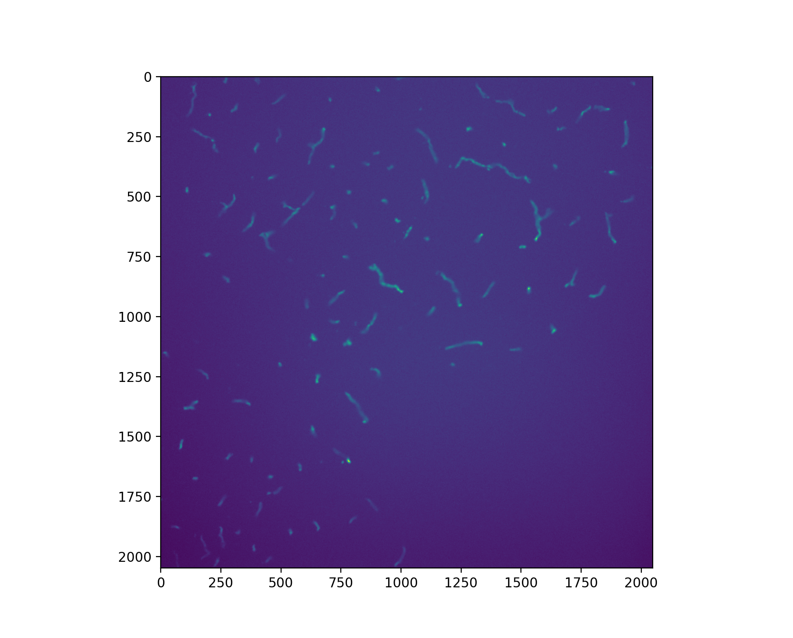
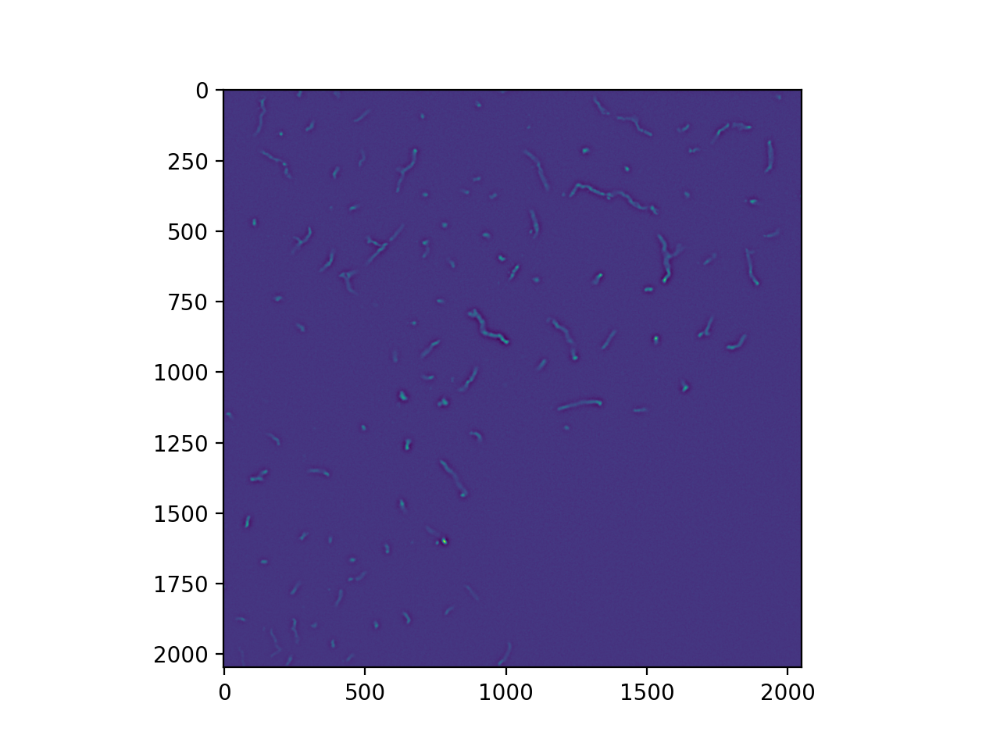
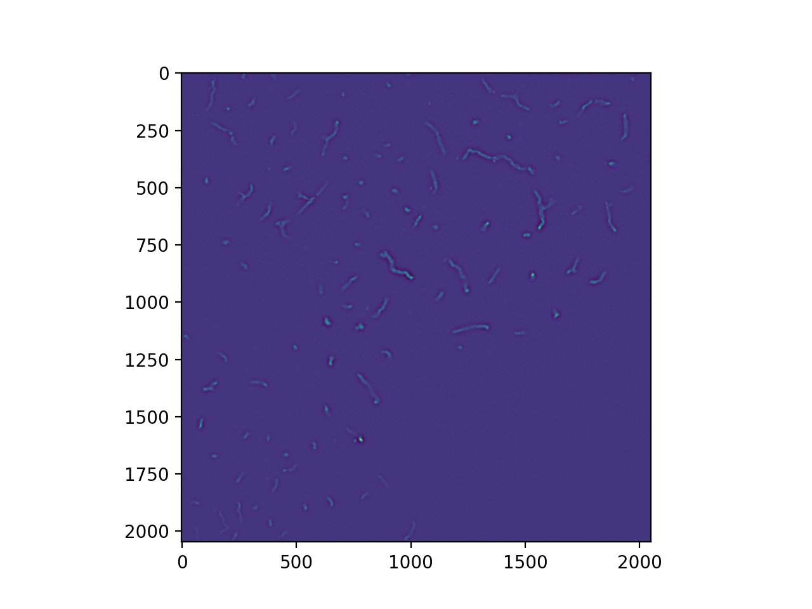
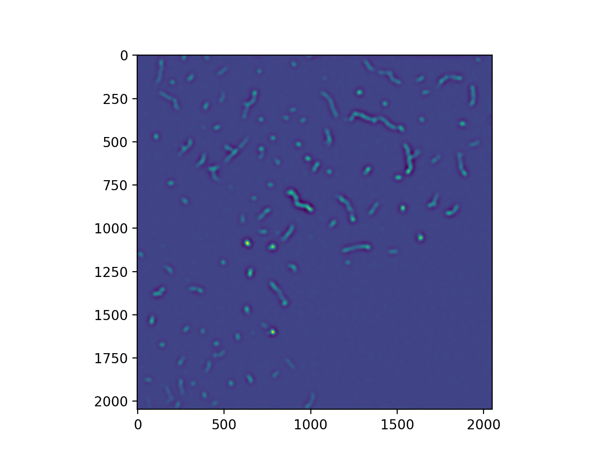
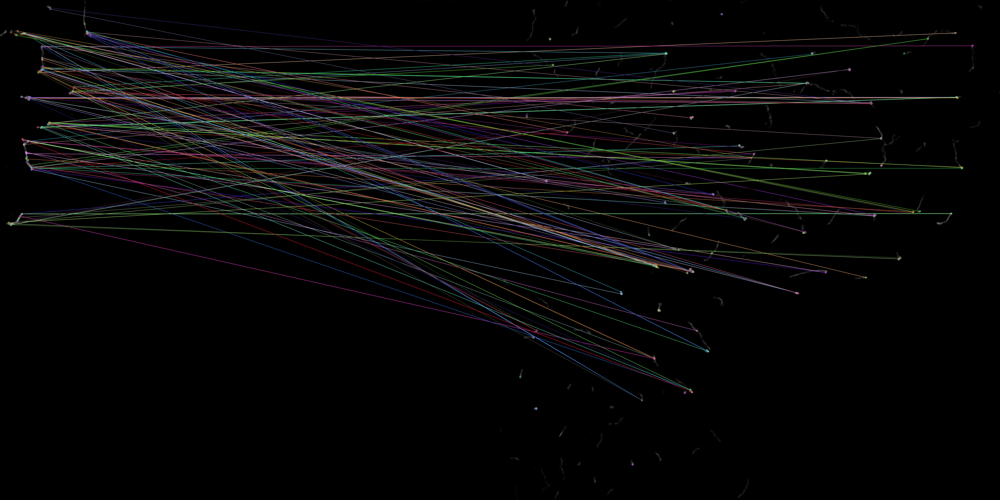
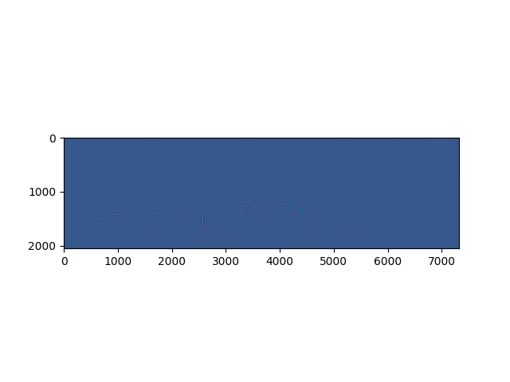
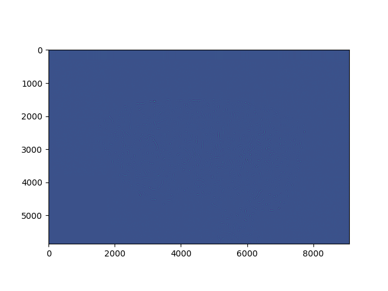
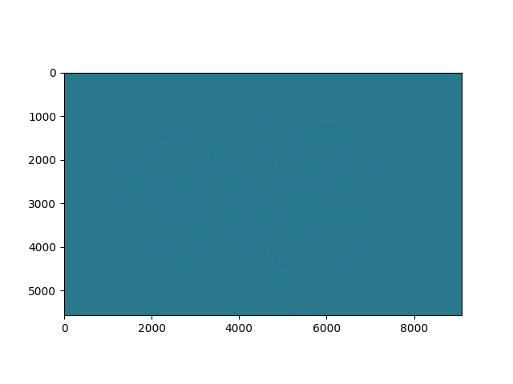
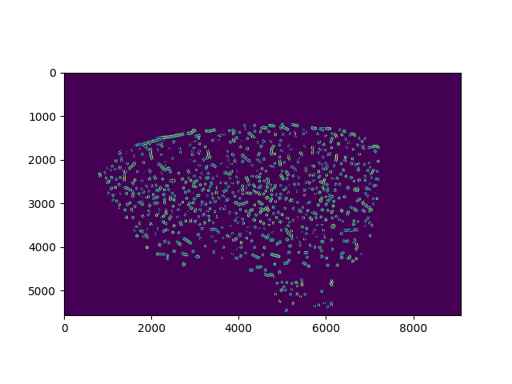

# 2d-to-3d registration

Written BY: Kaleb Vinehout:  klvinehout@gmail.com

# About The Project:

    This code combines 2D images from fluorescence microscopy into a 3D volume. 
    This involves ridgid transforms to stich together overlapping images and affine registration to combine physical non-overlapping slices.
    This can also be used to copy the resgitration transforms from one channel to another imaging channel. This outputs the registraation files, the registreed data as a numpy array and images of the raw and feature map registered.
    There are four main parts: 1) Denoise, 2) registraion within optical slice, 3) stiching images along X and Y together, and 4) aligning physical Z slices together.

#### Preprocessing: Denoise

        -denoise methods from scikit:  https://scikit-image.org/docs/dev/auto_examples/filters/plot_denoise.html
        -Wavelet denoising filter: This wavelet denoising filter relies on the wavelet representation of the image. The noise is represented by small values in the wavelet domain which are set to 0.
        -Total variation filter: We use the TV Chambolle filter. The result of this filter is an image that has a minimal total variation norm, while being as close to the initial image as possible. The total variation is the L1 norm of the gradient of the image.
        -difference_of_gaussians: Difference of Gaussians method for applying band-pass filters to multi-dimensional arrays
        -denoise_nl_means: The non-local means algorithm is well suited for denoising images with specific textures. The principle of the algorithm is to average the value of a given pixel with values of other pixels in a limited neighbourhood

Image Raw data:

Image data after band-pass filter:

Image data after Wavelet denoising filter:

Image of after non-local means:

Image of after Total variation filter:

#### Step 1: Rigidly Register within each POS folder

        - Use phase correlation to register within optical slice
        - If values are non-zero denoiseing is perfomred
            -Phase correlation performed on denoised values

#### Step 2: Rigidly Stitch together X and Y to create physical slice Z plane

        - Use open CV feautre detection or user provided value to determine rough image overlap (or use user provied value)
        - Image overlaping areas are phase correlated to determine translation
        - default image overlap is applied to blank images
        -If images are shifted greater then error tolerance images are denoised
            -phase correlation on these denoised images, this is useful if few blood vessels in image

Image of feature-based registration:

Image of after X stitching registration:

Image of after X & Y stitching registration:

#### Step 3: Register Z planes together

        - denoise the Z plane image
        - segment the Z plane image
        - determine angle rotation with polar and log polar transfomations
        - deterimine translation with phase correlation of segmented images
        - use optical flow registration for non-linear aligment of Z planes 

Image of after denoise:

Image of after segmentation:

# PREREQUISITE:

    -Docker 

# ASSUMPTIONS:

    -overlap in X is same for all cubes within defined error (suggested 15%)
    -overlap in Y is same for all cubes within defined error (suggested 15%)

# INPUTS:

#### These are REQUIRED inputs arguments
    --seq_dir: This is used to define the order of folders representing physical slices. Here set equal to 'top' if POS1 is above POS 0 and 'bottom' if POS 1 is below POS 0 (EX: --seq_dir='top')
    --image_type: This is the file name prefex of images to register (img_000000000_Il-A_000.tif)  Note its assumed optical Z number is after this label in the image name (ex:'--image_type = 'Il-A')
    --localsubjectpath: This is full path where to load and save files  (ex:' --localsubjectpath='/grid/zador/home/vinehout/code/2d_3D_linear_reg/')
    --remotesubjectpath: This is full path where to files are located eaither locally (ex:--remotesubjectpath='/grid/zador/home/vinehout/code/2d_3D_linear_reg/data') or on remote server (ex:--remotesubjectpath='/home/imagestorage/lectin_1/')

#### These are optional but suggested input arguments
    --input_overlap: Percent image overlap. 0-1, 0.10 represents 10 percent. (ex:--input_overlap=0.10) Feature based registration is used if this value is not given.

#### These are optional input arguments

    --opticalZ_dir: This defines the direction the images are stacked within a given folder. For example within folder Pos7_004_000 if the image img_000000000_Il-A_001.tif is on 'top' of img_000000000_Il-A_000.tif image or if img_000000000_Il-A_001.tif is on 'bottom' of img_000000000_Il-A_000.tif. This input can eaither be 'top' or 'bottom' (ex: --opticalZ_dir='top') (default: 'top'") choices=['top', 'bottom']
    --X_dir: This defines the X direction to stich images together (either shift images to the left or right). This value is defined based on the location of X=0, use 'left' if X=0 is on the left side of the physical slice or 'right' if X=0 is on the right side. (ex:--X_dir='right') (default='right') choices=['left', 'right']
    --Y_dir: This defines the Y direction to stich images together (either shift images to the top or bottom). This value is defined based on the location of Y=0, use 'top' if Y=0 is on the top of the physical slice or 'bottom' if X=0 is on the bottom. (ex:--X_dir='top') (default='top') choices=['top', 'bottom']
    --server: This is only needed if the data is stored on a remote location. This is used to login to remote server. This is the name of server files are located,(ex:'--server=zadorstorage2.cshl.edu') set to 'local' if files on local computer. (default: 'local')")
    --user: This is only needed if the data is stored on a remote location. This is used to login to remote server. Name of user to access server where filels are located,(ex:--user='user1'), Not required files on local computer. (default: None)")
    --password : "This is only needed if the data is stored on a remote location. This is used to login to remote server. Password to access server where filels are located,(ex:--password='mypassword'), Not required files on local computer. (default: None)
    --FFT_max_gaussian: This is used to filter out low frequence signals in the images. This is the high_Sigma value for band pass filtering to remove low frequencies. (ex: --FFT_max_gaussian=10) See skimage.filters.difference_of_gaussians for details (default: 10)")
    --error_overlap: this defines the acceptable error or input_overlap and calculated actuaal registration values. This is used to define when a registration method fails and when to try different methods within the program. This percentage error repersented as a decimal so 0.15 is 15% of the input_overlap is the maximum amount the image is expect to shift. (ex: --error_overlap=0.15) (default 15 percent: i.e. 0.15)
    --blank_thres: Threshold to identifiy blank images. Used to see if max more then blank_thres * greater then mean of image. This is also used to skip feature detection on images if the overlap is blank and the whole image is blank based on this threhold. If feature detection is giving zero images change this threshold. (ex: --blank_thres=1.5) (default: 1.5)
    --checkerboard_size: Used in segmentation of images to ID feautre map. This is the square size for segmentation (ex: --checkerboard_size=6) see: skimage.segmentation.checkerboard_level_set (default: 6)")
    --seg_interations: Used in segmentation of images to ID feautre map. This in the number of segmentation interactions (ex:--seg_interations=35) see: skimage.segmentation.morphological_chan_vese (defual:35)")
    --seg_smooth : Used in segmentation of images to ID feautre map. This is the number of smoothing interations durring segmentation (ex:--seg_smooth=3) see:  skimage.segmentation.morphological_chan_vese ( efult: 3)")
    --POS_folder_Z: Only needed if folders with images dont follow the format POSZ(Z)_XXX_YYY. This defines the position of the Z value in the folder name. Only numbers are indexed, so POS1_001_001 becomes 1001001 for indexing. (EX: --POS_folder_Z 0 -6) This works for the file POSZ(Z)_XXX_YYY. Here python slice notation is used. (defualt [0,-6]
    --POS_folder_X: Only needed if folders with images dont follow the format POSZ(Z)_XXX_YYY. This defines the position of the X value in the folder name. Only numbers are indexed, so POS1_001_001 becomes 1001001 for indexing. (EX: --POS_folder_X -6 -3) This works for the file POSZ(Z)_XXX_YYY. Here python slice notation is used. (defualt [6,-3]
    --POS_folder_Y: Only needed if folders with images dont follow the format POSZ(Z)_XXX_YYY. This defines the position of the Y value in the folder name. Only numbers are indexed, so POS1_001_001 becomes 1001001 for indexing. (EX: --POS_folder_X -2,-1) This works for the file POSZ(Z)_XXX_YYY. Here python slice notation is used. (defualt [-2,-1]
    --extra_figs:This is used to save additional figured useful in troubleshooting, results saved in registration folder. (ex: --saved_transforms_path=True). (Default: Fasle)
    --max_Z_proj_affine:This is used to use max Z projections instead of once slice for affine Z slice to Z slice calculateions.  Set to true if images are  noisy, or false if low noise levels. (ex:--max_Z_proj_affine=False)(defualt:True)
    --high_thres: This is used to theshold image. Values above high_thres * the mean of the image will be set to zero (ex:--high_thres=10)(default:10)
    --rigid_2d3d: This is used to only run rigid registratiion on feature map when combining Z planes, otherwise affine registration with optical flow is preformed.(ex:--rigid_2d3d=False)(default:False)
    --output: This is used to define the output folder.(ex:--output='registration')(default:'registration')
    --apply_transform: This is set to true if you want to apply transfomations calculated on a diffferent image channel to the image channel provided here. --saved_transforms_path needs to be defined for this work. (defualt: False)
    --saved_transforms_path: This is used if --apply_transform is set to true. This is the full path to the folder where registration files from another set of images are saved. This needs to included image type for saved files (ex: Il-A)  ex: '/Users/kaleb/data/2d_3D_linear_reg/registration/Il-A'. (default:none)
    --find_rot: This is set to true to look for 180 degree rotated physical slices.(ex:--find_rot=True)(default:'Fasle')
    --degree_thres: This is used to define the angle error tolerance from Physical Z slice to Physical Z slice registration, this tolerance is added to a search around zero and 180 degrees. Values are in degrees. (ex:--degree_thres=10)(default:10)
    --denoise_all:This is used to output a denoise array that is the same size as the full dataset. If set to false the denoise array is only the images used for registration. (ex:--denoise_all=True)(default:True)

# OUTPUTS:
    -outputs are saved under 'localsubjectpath/registration'
    -reg_3Dimage: numpy array of 3D brain
    -3D_brain_rotate: .gif of roating 3D brain based on features
    -3D_brain_slide: .gif of 3D brain sliding though 2D slices
    - *target_overlapX.npy, *target_overlapY.npy, *shift_within.npy, *shiftX.npy, *shiftY.npy, *shiftZ.npy : these are the registration value that can be used on another channel to provide same registration as applied to this image

# FILES:
    -docker: This is to create docker file with versions of all software packages used 
    -Main_2d_3d.py: main python script
    -func_2d_3d.py: functions for main file
    -Main_file.sh: This is an example fille with options to run program 
    -README.md: this file

# USEAGE:

    #this converts 2D barseq data into 2D barseq data
    python Main_2d_3d.py --remotesubjectpath='/home/imagestorage/ZadorConfocal1/xiaoyin/20201205JB050tomatolectinlabeling647/lectin_1/' --localsubjectpath='/grid/zador/home/vinehout/code/2d_3D_linear_reg/' --X_dir='right' --Y_dir='top' --image_type='Il-A' --seq_dir='top' --opticalZ_dir='top' --input_overlap=0.15 --server='zadorstorage2.cshl.edu' --user='user1' --password='password'
    #this applys registration transfromation to different channel data 
    python Main_2d_3d.py --remotesubjectpath='/home/imagestorage/ZadorConfocal1/xiaoyin/20201205JB050tomatolectinlabeling647/lectin_1/' --localsubjectpath='/grid/zador/home/vinehout/code/2d_3D_linear_reg/' --X_dir='right' --Y_dir='top' --image_type='X1' --seq_dir='top' --opticalZ_dir='top' --input_overlap=0.15 --server='zadorstorage2.cshl.edu' --user='user1' --password='password' --apply_transform=True --saved_transforms_path='/Users/kaleb/Documents/CSHL/ML_basecalling/code/2d_3D_linear_reg/registration/Il-A'
    # this is useage for multiple folders of data 
    python Main_2d_3d.py --remotesubjectpath='/home/imagestorage/xichen/20210308BaylorSample1/lectin_131415_1/' --remotesubjectpath='/home/imagestorage/xichen/20210308BaylorSample1/lectin_161718_1/' --localsubjectpath='/Users/kaleb/Documents/CSHL/2d_3D_linear_reg/' --image_type='Il-A' --X_dir='right' --Y_dir='top' --seq_dir='top' --opticalZ_dir='bottom' --input_overlap=0.15 --server='zadorstorage4.cshl.edu' --user='user1' --password='password' --output='registration_save' --extra_figs=False --max_Z_proj_affine=False --find_rot=True --rigid_2d3d=False --denoise_all=True

